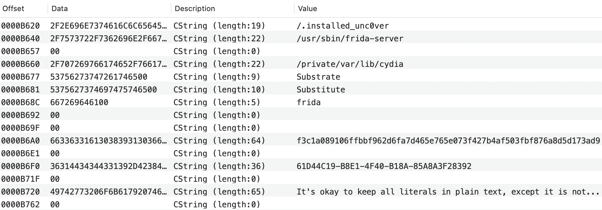

# Swift Confidential

[](https://github.com/securevale/swift-confidential/actions/workflows/ci.yml)
[](https://codecov.io/gh/securevale/swift-confidential)
[](https://www.swift.org/download)
[]()

A highly configurable and performant tool for obfuscating Swift literals embedded in the application code that you should protect from static code analysis, making the app more resistant to reverse engineering.

Simply integrate the tool with your Swift package or Xcode project, configure your own obfuscation algorithm along with the list of secret literals, and build the project 🚀

Swift Confidential can save you a lot of time, especially if you are developing an iOS app and seeking to meet [OWASP MASVS-RESILIENCE](https://mas.owasp.org/MASVS/11-MASVS-RESILIENCE/) requirements.

## Motivation

Pretty much every single app has at least few literals embedded in code, those include: URLs, various client identifiers (e.g. API keys or API tokens), pinning data (e.g. PEM certificates or SPKI digests), Keychain item identifiers, RASP-related literals (e.g. list of suspicious dylibs or list of suspicious file paths for jailbreak detection), and many other context-specific literals. While the listed examples of code literals might seem innocent, not obfuscating them, in many cases, can be considered as giving a handshake to the potential threat actor. This is especially true in security-sensitive apps, such as mobile banking apps, 2FA authenticator apps and password managers. As a responsible software engineer, you should be aware that extracting source code literals from the app package is generally easy enough that even less expirienced malicious users can accomplish this with little effort.

<p align="center">
    
    <em>A sneak peek at the __TEXT.__cstring section in a sample Mach-O file reveals a lot of interesting information about the app.</em>
</p>

This tool aims to provide an elegant and maintainable solution to the above problem by introducing the composable obfuscation techniques that can be freely combined to form an algorithm for obfuscating selected Swift literals. 

> [!NOTE]  
> While Swift Confidential certainly makes the static analysis of the code more challenging, **it is by no means the only code hardening technique that you should employ to protect your app against reverse engineering and tampering**. To achieve a decent level of security, we highly encourage you to supplement this tool's security measures with **runtime application self-protection (RASP) checks**, as well as **Swift code obfuscation**. With that said, no security measure can ever guarantee absolute security. Any motivated and skilled enough attacker will eventually bypass all security protections. For this reason, **always keep your threat models up to date**.

## Getting started

Begin by creating a `confidential.yml` YAML configuration file in the root directory of your SwiftPM target's sources or Xcode project (depending on the preferred [installation method](#installation)). At minimum, the configuration must contain obfuscation algorithm and one or more secret definitions.

For example, a configuration file for the hypothetical `RASP` module could look like this:

```yaml
algorithm:
  - encrypt using aes-192-gcm
  - shuffle
defaultNamespace: create ObfuscatedLiterals
secrets:
  - name: suspiciousDynamicLibraries
    value:
      - Substrate
      - Substitute
      - FridaGadget
      # ... other suspicious dylibs
  - name: suspiciousFilePaths
    value:
      - /.installed_unc0ver
      - /usr/sbin/frida-server
      - /private/var/lib/cydia
      # ... other suspicious file paths
```

> [!WARNING]  
> The algorithm from the above configuration serves as example only, **do not use this particular algorithm in your production code**. Instead, compose your own algorithm from the [obfuscation techniques](#obfuscation-techniques) described below and **don't share your algorithm with anyone**. Moreover, following the [secure SDLC](https://owasp.org/www-project-integration-standards/writeups/owasp_in_sdlc/) best practices, consider not to commit the production algorithm in your repository, but instead configure your CI/CD pipeline to run a custom script (ideally just before the build step), which will modify the configuration file by replacing the algorithm value with the one retrieved from the secrets vault.

Having created the configuration file, you can use the [Confidential build tool plugin](https://github.com/securevale/swift-confidential-plugin) (see [Installation section](#installation) below) to generate Swift code with obfuscated secret literals.

Under the hood, the Confidential plugin invokes the `swift-confidential` CLI tool by issuing the following command:

```sh
swift-confidential obfuscate --configuration "path/to/confidential.yml" --output "${PLUGIN_WORK_DIRECTORY}/ObfuscatedSources/Confidential.generated.swift"
```

Upon successful command execution, the generated `Confidential.generated.swift` file will contain code similar to the following:

```swift
import ConfidentialKit
import Foundation

internal enum ObfuscatedLiterals {

    @ConfidentialKit.Obfuscated<Swift.Array<Swift.String>>(deobfuscateData)
    internal static var suspiciousDynamicLibraries: ConfidentialKit.Obfuscation.Secret = .init(data: [0x14, 0x4b, 0xe5, 0x48, 0xd2, 0xc4, 0xb1, 0xba, 0xac, 0xa8, 0x65, 0x8e, 0x15, 0x34, 0x12, 0x87, 0x35, 0x49, 0xfb, 0xa4, 0xc8, 0x10, 0x5f, 0x4a, 0xe0, 0xf3, 0x69, 0x4a, 0x53, 0xa1, 0xdf, 0x58, 0x9d, 0x45, 0xa3, 0xf3, 0x00, 0xa2, 0x0f, 0x9c, 0x7d, 0x93, 0x14, 0x20, 0x04, 0xb2, 0xe8, 0x97, 0x26, 0x04, 0x5b, 0x00, 0x9e, 0x06, 0x30, 0x23, 0xaa, 0xa2, 0xc4, 0xfc, 0xba, 0x22, 0x97, 0x2b, 0x2d, 0x6e, 0x5f, 0x1d, 0xd5, 0xab, 0x9a, 0xe0, 0xf3, 0x1f, 0x17, 0x58, 0xab, 0xda, 0x49, 0x0a, 0xc2, 0x0a, 0xa2, 0x9a, 0xcc, 0x6d, 0x8c, 0x5e, 0xc0, 0x73, 0x77, 0x76, 0x6c, 0x2f, 0x2c, 0x2b, 0x2a, 0x65, 0x48, 0x04, 0x01, 0x07, 0x0b, 0x78, 0x1c, 0x52, 0x6a, 0x6f, 0x0e, 0x01, 0x6e, 0x63, 0x08, 0x5b, 0x62, 0x5f, 0x59, 0x72, 0x5a, 0x5c, 0x68, 0x1f, 0x1a, 0x64, 0x12, 0x13, 0x19, 0x55, 0x53, 0x4f, 0x06, 0x4e, 0x46, 0x7e, 0x10, 0x60, 0x40, 0x7d, 0x48, 0x76, 0x77, 0x4a, 0x7f, 0x1d, 0x71, 0x51, 0x03, 0x7a, 0x47, 0x09, 0x56, 0x11, 0x6c, 0x49, 0x0a, 0x04, 0x5e, 0x0f, 0x61, 0x65, 0x41, 0x75, 0x73, 0x4b, 0x57, 0x0d, 0x42, 0x02, 0x4c, 0x1e, 0x18, 0x1b, 0x45, 0x69, 0x66, 0x00, 0x7b, 0x6b, 0x70, 0x6d, 0x50, 0x0c, 0x5d, 0x54, 0x4d, 0x79, 0x74, 0x58, 0x44, 0x05, 0x43, 0x7c, 0x67], nonce: 13452749969377545032)

    @ConfidentialKit.Obfuscated<Swift.Array<Swift.String>>(deobfuscateData)
    internal static var suspiciousFilePaths: ConfidentialKit.Obfuscation.Secret = .init(data: [0x04, 0xdf, 0x99, 0x61, 0x39, 0xca, 0x19, 0x3d, 0xcd, 0xa9, 0xd0, 0xf3, 0x31, 0xc9, 0x8a, 0x2a, 0x00, 0x76, 0x51, 0xab, 0xae, 0xc1, 0xf8, 0x31, 0x00, 0x14, 0x40, 0x78, 0x5e, 0x8e, 0x14, 0x98, 0xc4, 0xbb, 0x26, 0xb4, 0x48, 0x6c, 0x56, 0xd8, 0x99, 0x31, 0x19, 0x96, 0xce, 0x8a, 0x97, 0x00, 0xde, 0xa4, 0x83, 0xe0, 0xcc, 0x1a, 0x3b, 0x2a, 0x55, 0xb7, 0x72, 0x36, 0xa1, 0xd2, 0x70, 0x0c, 0x8d, 0xe6, 0xe6, 0x78, 0x41, 0xa9, 0xdb, 0x45, 0x38, 0x5b, 0x97, 0x22, 0xb4, 0x8a, 0x4d, 0xd6, 0x59, 0xaa, 0x4e, 0xf7, 0x36, 0xba, 0xda, 0x0c, 0xb2, 0x82, 0x9e, 0x64, 0xd4, 0x41, 0xd7, 0x48, 0x0b, 0x04, 0xa4, 0x77, 0xfa, 0xcf, 0x07, 0xd2, 0x3b, 0x4d, 0xc7, 0x3d, 0x65, 0xb2, 0xfa, 0x1c, 0x77, 0x7f, 0xd4, 0x24, 0xf3, 0x99, 0xbd, 0xad, 0x1e, 0x17, 0x8e, 0x5a, 0xc2, 0xae, 0x9d, 0xb5, 0xa1, 0x3d, 0x1a, 0x70, 0xcd, 0x80, 0x8e, 0x9a, 0xb1, 0x75, 0xf3, 0x8c, 0xc7, 0x01, 0x94, 0x9e, 0xaf, 0x98, 0xb8, 0xf9, 0xd0, 0xbd, 0xbe, 0xca, 0xe5, 0xcc, 0xfa, 0xc6, 0xa3, 0xec, 0xae, 0x8a, 0xb9, 0xd6, 0xbb, 0x01, 0xc7, 0x8b, 0xc1, 0xac, 0xc9, 0xd8, 0x86, 0xf5, 0xe7, 0xb3, 0xc8, 0xfd, 0x99, 0xdc, 0xc4, 0x81, 0xad, 0xd4, 0xe0, 0x9f, 0xa6, 0x05, 0x8d, 0xea, 0x96, 0xa9, 0xe8, 0x92, 0xf6, 0x90, 0x8f, 0xb5, 0xb1, 0xb7, 0xc0, 0xdd, 0xce, 0xfb, 0xab, 0xe9, 0xe4, 0xf8, 0xe6, 0xc3, 0xba, 0xa7, 0xdb, 0xf4, 0xcb, 0xfe, 0xc5, 0xde, 0xd7, 0xcd, 0xf3, 0xd2, 0xe2, 0x88, 0xa8, 0xcf, 0x95, 0x93, 0x9a, 0xa1, 0xe1, 0xfc, 0xb4, 0x82, 0xb0, 0xd3, 0xf0, 0x97, 0xd5, 0xf7, 0x87, 0x03, 0xef, 0xdf, 0xbf, 0xee, 0x9c, 0x8e, 0x02, 0xb2, 0x91, 0xa4, 0x89, 0xeb, 0xa0, 0xd9, 0xf1, 0xc2, 0xff, 0xe3, 0xb6, 0xaa, 0x00, 0xa5, 0xed, 0xda, 0xbc, 0xd1, 0x9d, 0x80, 0x9b, 0x8c, 0xa2, 0x84, 0x85, 0x83, 0xf2], nonce: 4402772458530791297)

    @inline(__always)
    private static func deobfuscateData(_ data: Foundation.Data, nonce: Swift.UInt64) throws -> Foundation.Data {
        try ConfidentialKit.Obfuscation.Encryption.DataCrypter(algorithm: .aes192GCM)
            .deobfuscate(
                try ConfidentialKit.Obfuscation.Randomization.DataShuffler()
                    .deobfuscate(data, nonce: nonce),
                nonce: nonce
            )
    }
}
```

You can then, for example, iterate over a deobfuscated array of suspicious dynamic libraries in your own code using the projected value of the generated `suspiciousDynamicLibraries` property:

```swift
let suspiciousLibraries = ObfuscatedLiterals.$suspiciousDynamicLibraries
    .map { $0.lowercased() }
let checkPassed = loadedLibraries
    .allSatisfy { !suspiciousLibraries.contains(where: $0.lowercased().contains) }
```

### Installation

Swift Confidential can be used with both SwiftPM and Xcode targets, depending on your needs. Please see the relevant section below for detailed installation instructions.

<details>
<summary><strong>SwiftPM</strong></summary>

To use Swift Confidential with your SwiftPM target, add the `ConfidentialKit` library along with `Confidential` plugin to the package's dependencies and then to your target's dependencies and plugins respectively:

```swift
// swift-tools-version: 5.7

import PackageDescription

let package = Package(
    // name, platforms, products, etc.
    dependencies: [
        // other dependencies
        .package(url: "https://github.com/securevale/swift-confidential.git", .upToNextMinor(from: "0.3.0")),
        .package(url: "https://github.com/securevale/swift-confidential-plugin.git", .upToNextMinor(from: "0.3.0"))
    ],
    targets: [
        .target(
            name: "MyLibrary",
            dependencies: [
                // other dependencies
                .product(name: "ConfidentialKit", package: "swift-confidential")
            ],
            exclude: ["confidential.yml"],
            plugins: [
                // other plugins
                .plugin(name: "Confidential", package: "swift-confidential-plugin")
            ]
        )
    ]
)
```

Please make sure to add a path to the `confidential.yml` configuration file to target's `exclude` list to explicitly exclude this file from the target's resources.
</details>

<details>
<summary><strong>Xcode</strong></summary>

To integrate Swift Confidential directly with your Xcode target:

* Add `swift-confidential` and `swift-confidential-plugin` packages to your Xcode project. Please refer to the [official documentation](https://developer.apple.com/documentation/xcode/adding-package-dependencies-to-your-app) for step-by-step instructions on how to add package dependencies. When asked to choose `swift-confidential` package products to be added to your target, make sure to select the `ConfidentialKit` library.
* Then, navigate to your target’s `Build Phases` pane, and in the `Run Build Tool Plug-ins` section, click the `+` button, select the `Confidential` plugin, and click the `Add` button.

For convenience, you can also add the `confidential.yml` configuration file to your Xcode project, but **be sure not to add it to any of the Xcode targets**.
</details>

Once set up, build your target and the Confidential plugin will automatically generate a Swift source file with obfuscated secret literals. In addition, the plugin will regenerate the obfuscated secret literals every time it detects a change to `confidential.yml` configuration file or when you clean build your project.

> [!IMPORTANT]  
> Make sure to use the same version requirements for both `swift-confidential` and `swift-confidential-plugin` packages. See [Versioning](#versioning) section for more information about API stability.

## Configuration

Swift Confidential supports a number of configuration options, all of which are stored in a single YAML configuration file.

### YAML configuration keys

The table below lists the keys to include in the configuration file along with the type of information to include in each. Any other keys in the configuration file are ignored by the CLI tool.

| Key                      | Value type          | Description                                                                       |
|--------------------------|---------------------|-----------------------------------------------------------------------------------|
| algorithm                | List of strings     | The list of obfuscation techniques representing individual steps that are composed together to form the obfuscation algorithm. See [Obfuscation techniques](#obfuscation-techniques) section for usage details.<br/><sub>**Required.**</sub> |
| defaultAccessModifier    | String              | The default access-level modifier applied to each generated secret literal, unless the secret definition states otherwise. The default value is `internal`. See [Access control](#access-control) section for usage details. |
| defaultNamespace         | String              | The default namespace in which to enclose all the generated secret literals without explicitly assigned namespace. The default value is `extend Obfuscation.Secret from ConfidentialKit`. See [Namespaces](#namespaces) section for usage details. |
| implementationOnlyImport | Boolean             | Specifies whether to generate implementation-only `ConfidentialKit` import. The default value is `false`. See [Building libraries for distribution](#building-libraries-for-distribution) section for usage details. |
| internalImport           | Boolean             | Specifies whether to generate internal `ConfidentialKit` import. The default value is `false`. See [Building libraries for distribution](#building-libraries-for-distribution) section for usage details. |
| secrets                  | List of objects     | The list of objects defining the secret literals to be obfuscated. See [Secrets](#secrets) section for usage details.<br/><sub>**Required.**</sub> |

<details>
<summary><strong>Example configuration</strong></summary>

```yaml
algorithm:
  - encrypt using aes-192-gcm
  - shuffle
defaultNamespace: create Secrets
secrets:
  - name: apiKey
    value: 214C1E2E-A87E-4460-8205-4562FDF54D1C
  - name: trustedSPKIDigests
    value:
      - 7a6820614ee600bbaed493522c221c0d9095f3b4d7839415ffab16cbf61767ad
      - cf84a70a41072a42d0f25580b5cb54d6a9de45db824bbb7ba85d541b099fd49f
      - c1a5d45809269301993d028313a5c4a5d8b2f56de9725d4d1af9da1ccf186f30
    namespace: extend Pinning from Crypto
```

> **Warning**  
> The algorithm from the above configuration serves as example only, **do not use this particular algorithm in your production code**.
</details>

### Obfuscation techniques

The obfuscation techniques are the composable building blocks from which you can create your own obfuscation algorithm. You can compose them in any order you want, so that no one exept you knows how the secret literals are obfuscated.

#### Compression

This technique involves data compression using the algorithm of your choice. In general, the compression technique is *non-polymorphic*, meaning that given the same input data, the same output data is produced with each run. However, Swift Confidential applies additional polymorphic obfuscation routines to mask the bytes identifying the compression algorithm used.

**Syntax**

```yaml
compress using <algorithm>
```

The supported algorithms are shown in the following table:
| Algorithm        | Description                                               |
|------------------|-----------------------------------------------------------|
| lzfse            | The LZFSE compression algorithm.                          |
| lz4              | The LZ4 compression algorithm.                            |
| lzma             | The LZMA compression algorithm.                           |
| zlib             | The zlib compression algorithm.                           |

#### Encryption

This technique involves data encryption using the algorithm of your choice. The encryption technique is *polymorphic*, meaning that given the same input data, different output data is produced with each run.

**Syntax**

```yaml
encrypt using <algorithm>
```

The supported algorithms are shown in the following table:
| Algorithm        | Description                                                                                     |
|------------------|-------------------------------------------------------------------------------------------------|
| aes-128-gcm      | The Advanced Encryption Standard (AES) algorithm in Galois/Counter Mode (GCM) with 128-bit key. |
| aes-192-gcm      | The Advanced Encryption Standard (AES) algorithm in Galois/Counter Mode (GCM) with 192-bit key. |
| aes-256-gcm      | The Advanced Encryption Standard (AES) algorithm in Galois/Counter Mode (GCM) with 256-bit key. |
| chacha20-poly    | The ChaCha20-Poly1305 algorithm.                                                                |

#### Randomization

This technique involves data randomization. The randomization technique is *polymorphic*, meaning that given the same input data, different output data is produced with each run.

> [!NOTE]  
> Randomization technique is best suited for secrets of which size does not exceed 256 bytes. For larger secrets, the size of the obfuscated data will grow from 2N to 3N, where N is the input data size in bytes, or even 5N (32-bit platform) or 9N (64-bit platform) if the size of input data is larger than 65 536 bytes. For this reason, the internal implementation of this technique is a subject to change in next releases.

**Syntax**

```yaml
shuffle
```

### Secrets

The configuration file utilizes YAML objects to describe the secret literals, which are to be obfuscated. The table below lists the keys to define secret literal along with the type of information to include in each.

| Key              | Value type                | Description                                                                      |
|------------------|---------------------------|----------------------------------------------------------------------------------|
| accessModifier   | String                    | The access-level modifier of the generated Swift property containing obfuscated secret literal's data. The supported values are `internal` and `public`. If not specified, the top-level `defaultAccessModifier` value is used. See [Access control](#access-control) section for usage details. |
| name             | String                    | The name of the generated Swift property containing obfuscated secret literal's data. This value is used as-is, without validity checking. Thus, make sure to use a valid property name.<br/><sub>**Required.**</sub> | 
| namespace        | String                    | The namespace in which to enclose the generated secret literal declaration. See [Namespaces](#namespaces) section for usage details. |
| value            | String or List of strings | The plain value of the secret literal, which is to be obfuscated. The YAML data types are mapped to `String` and `Array<String>` in Swift, respectively.<br/><sub>**Required.**</sub> |

<details>
<summary><strong>Example secret definition</strong></summary>

Supposing that you would like to obfuscate the tag used to reference the private key stored in Keychain or Secure Enclave:

```yaml
name: secretVaultKeyTag
value: com.example.app.keys.secret_vault_private_key
accessModifier: internal
namespace: extend KeychainAccess.Key from Crypto
```

The above YAML secret definition will result in the following Swift code being generated:

```swift
import Crypto
// ... other imports

extension Crypto.KeychainAccess.Key {

    @ConfidentialKit.Obfuscated<Swift.String>(deobfuscateData)
    internal static var secretVaultKeyTag: ConfidentialKit.Obfuscation.Secret = .init(data: [/* obfuscated data */], nonce: /* cryptographically secure random number */)

    // ... other secret declarations
}
```

You may also need to obfuscate a list of related values, such as a list of trusted SPKI digests to pin against:

```yaml
name: trustedSPKIDigests
value:
  - 7a6820614ee600bbaed493522c221c0d9095f3b4d7839415ffab16cbf61767ad
  - cf84a70a41072a42d0f25580b5cb54d6a9de45db824bbb7ba85d541b099fd49f
  - c1a5d45809269301993d028313a5c4a5d8b2f56de9725d4d1af9da1ccf186f30
accessModifier: public
namespace: extend Pinning from Crypto
```

With the above YAML secret definition, the following Swift code will be generated:

```swift
import Crypto
// ... other imports

extension Crypto.Pinning {

    @ConfidentialKit.Obfuscated<Swift.Array<Swift.String>>(deobfuscateData)
    public static var trustedSPKIDigests: ConfidentialKit.Obfuscation.Secret = .init(data: [/* obfuscated data */], nonce: /* cryptographically secure random number */)

    // ... other secret declarations
}
```
</details>

### Namespaces

In accordance with Swift programming best practices, Swift Confidential encapsulates generated secret literal declarations in namespaces (i.e. caseless enums). The namespaces syntax allows you to either create a new namespace or extend an existing one.

> [!NOTE]  
> The creation of the nested namespaces is currently not supported.

**Syntax**

```yaml
create <namespace> # creates new namespace

extend <namespace> [from <module>] # extends existing namespace, optionally specifying 
                                   # the module to which this namespace belongs
```

<details>
<summary><strong>Example usage</strong></summary>

Assuming that you would like to keep the generated secret literal declaration(s) in a new namespace named `Secrets`, use the following YAML code:

```yaml
create Secrets
```

The above namespace definition will result in the following Swift code being generated:

```swift
internal enum Secrets {

    // Encapsulated declarations ...
}

```

If, however, you would rather like to keep the generated secret literal declaration(s) in an existing namespace named `Pinning` and imported from `Crypto` module, use the following YAML code instead:

```yaml
extend Pinning from Crypto
```

With the above namespace definition, the following Swift code will be generated:

```swift
import Crypto
// ... other imports

extension Crypto.Pinning {

    // Encapsulated declarations ...
}
```
</details>

### Access control

You can specify the access-level modifiers for generated Swift code, both globally and on per secret basis. Yet, the general recommendation is to use the default `internal` access level, so as to keep your code well encapsulated.

**Syntax**

```yaml
<access_modifier>
```

The supported access-level modifiers are shown in the following table:
| Access modifier  | Description                                                                                     |
|------------------|-------------------------------------------------------------------------------------------------|
| internal         | The generated declarations are accessible only within their defining module.                    |
| public           | The generated declarations are accessible within their defining module and any module that imports the defining module. |

<details>
<summary><strong>Example usage</strong></summary>

Supposing that you would like to keep all your secret literals in a single shared Swift module used by other project modules/targets, you can do so with a configuration similar to this one:

```yaml
algorithm:
  - encrypt using aes-192-gcm
  - shuffle
defaultNamespace: create Secrets
defaultAccessModifier: public
secrets:
  - name: apiKey
    value: 214C1E2E-A87E-4460-8205-4562FDF54D1C
  - name: trustedSPKIDigests
    value:
      - 7a6820614ee600bbaed493522c221c0d9095f3b4d7839415ffab16cbf61767ad
      - cf84a70a41072a42d0f25580b5cb54d6a9de45db824bbb7ba85d541b099fd49f
      - c1a5d45809269301993d028313a5c4a5d8b2f56de9725d4d1af9da1ccf186f30
```

> **Warning**  
> The algorithm from the above configuration serves as example only, **do not use this particular algorithm in your production code**.

With `defaultAccessModifier` set to `public`, all of the Swift properties generated based on the `secrets` list are accessible outside their defining module:

```swift
import ConfidentialKit
import Foundation

public enum Secrets {

    @ConfidentialKit.Obfuscated<Swift.String>(deobfuscateData)
    public static var apiKey: ConfidentialKit.Obfuscation.Secret = .init(data: [/* obfuscated data */], nonce: /* cryptographically secure random number */)

    @ConfidentialKit.Obfuscated<Swift.Array<Swift.String>>(deobfuscateData)
    public static var trustedSPKIDigests: ConfidentialKit.Obfuscation.Secret = .init(data: [/* obfuscated data */], nonce: /* cryptographically secure random number */)

    // ...
}
```

Additionally, if you need more fine-grained control, you can override `defaultAccessModifier` by specifying the access-level modifier in the secret definition as described in [Secrets](#secrets) section.
</details>

### Building libraries for distribution

By default, Swift Confidential does not annotate the generated `ConfidentialKit` import with `@_implementationOnly` or `internal`. However, there are cases, such as when [creating an XCFramework bundle](https://developer.apple.com/documentation/xcode/creating-a-multi-platform-binary-framework-bundle), in which you should use this style of imports to avoid exposing internal symbols to consumers of your library. To enable this:
- Swift 6: set the `internalImport` configuration option to `true`.
- Swift 5 and earlier: set the `implementationOnlyImport` configuration option to `true`.

> [!IMPORTANT]  
> The implementation-only / internal imports are applicable for types used only internally, thus it is an error to enable `implementationOnlyImport` or `internalImport` if either of the secrets has access level set to `public`. Also note that setting either of these options to `true` does not affect imports for extended namespaces. Furthermore, note that only one of `implementationOnlyImport` and `internalImport` can take affect, and the `internalImport` will supercede the former, if they are both present.

### Additional considerations for Confidential Swift Package plugin

The [Confidential plugin](https://github.com/securevale/swift-confidential-plugin) expects the configuration file to be named `confidential.yml` or `confidential.yaml`, and it assumes a single configuration file per SwiftPM target/Xcode project. If you use the plugin with SwiftPM target and you define multiple configuration files in different subdirectories, then the plugin will use the first one it finds, and which one is undefined. Whereas, if you apply the plugin to the Xcode project's target, the configuration file is expected to be located in the project's top-level directory (all other configuration files are ignored).

## Versioning

This project follows [semantic versioning](https://semver.org/). While still in major version `0`, source-stability is only guaranteed within minor versions (e.g. between `0.3.0` and `0.3.1`). If you want to guard against potentially source-breaking package updates, you can specify your package dependency using source control requirement (e.g. `.upToNextMinor(from: "0.3.0")`).

## License

This tool and code is released under Apache License v2.0 with Runtime Library Exception. 
Please see [LICENSE](LICENSE) for more information.
