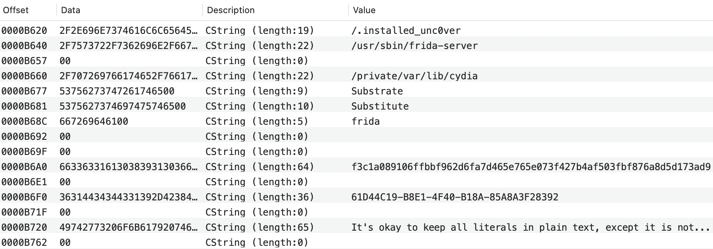

# Swift Confidential

[](https://github.com/securevale/swift-confidential/actions/workflows/ci.yml)
[](https://codecov.io/gh/securevale/swift-confidential)
[](https://www.swift.org/download)
[]()

A highly configurable and performant tool for obfuscating Swift literals embedded in the application code that you should protect against static code analysis, making the app more resistant to reverse engineering.

Use the [#Obfuscate macro](#getting-started) to obfuscate your secret literals directly in code, or adopt the [YAML-based approach with build tool plugin](#advanced-usage) for advanced use cases.

Swift Confidential can save you a lot of time, especially if you are developing an iOS app and seeking to meet [OWASP MASVS-RESILIENCE](https://mas.owasp.org/MASVS/11-MASVS-RESILIENCE/) requirements.

## Motivation

Pretty much every single app has at least few literals embedded in code, those include: URLs, various client identifiers (e.g. API keys), pinning data (e.g. X.509 certificates or SPKI digests), Keychain item identifiers, RASP-related literals (e.g. list of suspicious dylibs or list of suspicious file paths for jailbreak detection), and many other context-specific literals. While the listed examples of code literals might seem innocent, not obfuscating them, in many cases, can be considered as giving a handshake to the potential threat actor. This is especially true in security-sensitive apps, such as mobile banking apps, 2FA authenticator apps and password managers. As a responsible software engineer, you should be aware that extracting source code literals from the app package is generally easy enough that even less experienced malicious users can accomplish this with little effort.

<p align="center">
    
    <em>A sneak peek at the __TEXT.__cstring section in a sample Mach-O file reveals a lot of interesting information about the app.</em>
</p>

This tool aims to provide an elegant and maintainable solution to the above problem by introducing the composable obfuscation techniques that can be freely combined to form an algorithm for obfuscating selected Swift literals. 

> [!NOTE]  
> While Swift Confidential certainly makes the static analysis of the code more challenging, **it is by no means the only code hardening technique that you should employ to protect your app against reverse engineering and tampering**. To achieve a decent level of security, we highly encourage you to supplement this tool's security measures with **runtime application self-protection (RASP) checks**, as well as **Swift code obfuscation**. With that said, no security measure can ever guarantee absolute security. Any motivated and skilled enough attacker will eventually bypass all security protections. For this reason, **always keep your threat models up to date**.

## Getting Started

Add Swift Confidential to your SwiftPM or Xcode project. See the relevant installation instructions in the expandable sections below.

<details>
<summary>
    <strong>
        <a href="https://docs.swift.org/swiftpm/documentation/packagemanagerdocs/addingdependencies/">SwiftPM</a>
    </strong>
</summary>

1. Add the `swift-confidential` package dependency to your `Package.swift`:
   ```swift
   .package(url: "https://github.com/securevale/swift-confidential.git", .upToNextMinor(from: "0.5.0"))
   ```

2. Add the `ConfidentialKit` library dependency to your target:
   ```swift
   .product(name: "ConfidentialKit", package: "swift-confidential")
   ```
</details>

<details>
<summary>
    <strong>
        <a href="https://developer.apple.com/documentation/xcode/adding-package-dependencies-to-your-app">Xcode</a>
    </strong>
</summary>

1. Select `File` > `Add Package Dependencies...`.
2. In the `Search or Enter Package URL` field, enter the following URL:
   ```
   https://github.com/securevale/swift-confidential.git
   ```
3. Change the `Dependency Rule` to `Up to Next Minor Version`.
4. Click the `Add Package` button.
5. Select the target to which you want to add the `ConfidentialKit` package product and click the `Add Package` button.
</details>

Import and use the `Obfuscate(algorithm:declarations:)` macro in your code:

```swift
import ConfidentialKit

enum ObfuscatedLiterals {

    static #Obfuscate {
        // You can obfuscate a single string literal:
        let helloMessage = "Hello, Obfuscation!"
        // , or an array of string literals:
        let helloMessageWords = ["Hello", "Obfuscation"]
    }

    static #Obfuscate(algorithm: .custom([.encrypt(algorithm: .aes192GCM), .shuffle])) {
        let errorMessage = "404: World Not Found"
    }
}
```

In the above example, the `helloMessage` and `helloMessageWords` will each be obfuscated using a randomly generated obfuscation algorithm. The `errorMessage`, however, will be obfuscated using a custom obfuscation algorithm, as specified by the `algorithm` argument.

> [!NOTE]  
> You cannot use `Obfuscate(algorithm:declarations:)` macro at global scope. This aligns with the recommended practice of encapsulating secret declarations within namespaces, such as caseless enums.

> [!WARNING]  
> The custom obfuscation algorithm from the above code snippet serves as example only. **For production use, always compose your own algorithm from the available [obfuscation techniques](#obfuscation-techniques) and do not share it with anyone.**

You can then access a deobfuscated secret literal via its projected value:

```swift
print(ObfuscatedLiterals.$helloMessage)
```

See the [full documentation](https://swiftpackageindex.com/securevale/swift-confidential/documentation/confidentialkit) for more details.

## Advanced Usage

For advanced use cases, such as projects with many RASP-related literals and/or pins used for certificate pinning, it’s often preferable to manage all secret literals from a single source of truth (SSoT). Swift Confidential fulfills this need through its YAML-based mode of operation.

Begin by creating a `confidential.yml` YAML configuration file in the root directory of your SwiftPM target's sources or Xcode project (depending on the preferred [installation method](#installation)). At minimum, the configuration must contain one or more secret definitions.

For example, a configuration file for the hypothetical `RASP` module could look like this:

```yaml
defaultNamespace: create ObfuscatedLiterals
secrets:
  - name: suspiciousDynamicLibraries
    value:
      - Substrate
      - Substitute
      - FridaGadget
      # ... other suspicious dylibs
  - name: suspiciousFilePaths
    value:
      - /.installed_unc0ver
      - /usr/sbin/frida-server
      - /private/var/lib/cydia
      # ... other suspicious file paths
```

> [!TIP]  
> If you choose to use your own [obfuscation algorithm](#obfuscation-techniques), following the [secure SDLC](https://owasp.org/www-project-integration-standards/writeups/owasp_in_sdlc/) best practices, consider not to commit the production algorithm in your repository, but instead configure your CI/CD pipeline to run a custom script (ideally just before the build step), which will modify the configuration file by replacing the algorithm value with the one retrieved from the secrets vault.

Having created the configuration file, you can use the [Confidential build tool plugin](https://github.com/securevale/swift-confidential-plugin) (see [Installation section](#installation) below) to generate Swift code with obfuscated secret literals.

Under the hood, the Confidential plugin invokes the `swift-confidential` CLI tool by issuing the following command:

```sh
swift-confidential obfuscate --configuration "path/to/confidential.yml" --output "${PLUGIN_WORK_DIRECTORY}/ObfuscatedSources/Confidential.generated.swift"
```

Upon successful command execution, the generated `Confidential.generated.swift` file will contain code similar to the following:

```swift
import ConfidentialKit

internal enum ObfuscatedLiterals {

    internal static #Obfuscate(algorithm: .random) {
        let suspiciousDynamicLibraries = [
            "Substrate",
            "Substitute",
            "FridaGadget",
            // ... other suspicious dylibs
        ]
        let suspiciousFilePaths = [
            "/.installed_unc0ver",
            "/usr/sbin/frida-server",
            "/private/var/lib/cydia",
            // ... other suspicious file paths
        ]
    } 
}
```

You can then, for example, iterate over a deobfuscated array of suspicious dynamic libraries in your own code using the projected value of the generated `suspiciousDynamicLibraries` property:

```swift
let suspiciousLibraries = ObfuscatedLiterals.$suspiciousDynamicLibraries
    .map { $0.lowercased() }
let checkPassed = loadedLibraries
    .allSatisfy { !suspiciousLibraries.contains(where: $0.lowercased().contains) }
```

### Installation

Swift Confidential can be used with both SwiftPM and Xcode targets, depending on your needs. Please see the relevant section below for detailed installation instructions.

<details>
<summary><strong>SwiftPM</strong></summary>

To use Swift Confidential with your SwiftPM target, add the `ConfidentialKit` library along with `Confidential` plugin to the package's dependencies and then to your target's dependencies and plugins respectively:

```swift
// swift-tools-version: 6.0

import PackageDescription

let package = Package(
    // name, platforms, products, etc.
    dependencies: [
        // other dependencies
        .package(url: "https://github.com/securevale/swift-confidential.git", .upToNextMinor(from: "0.5.0")),
        .package(url: "https://github.com/securevale/swift-confidential-plugin.git", .upToNextMinor(from: "0.5.0"))
    ],
    targets: [
        .target(
            name: "MyLibrary",
            dependencies: [
                // other dependencies
                .product(name: "ConfidentialKit", package: "swift-confidential")
            ],
            exclude: ["confidential.yml"],
            plugins: [
                // other plugins
                .plugin(name: "Confidential", package: "swift-confidential-plugin")
            ]
        )
    ]
)
```

Please make sure to add a path to the `confidential.yml` configuration file to target's `exclude` list to explicitly exclude this file from the target's resources.
</details>

<details>
<summary><strong>Xcode</strong></summary>

To integrate Swift Confidential directly with your Xcode target:

* Add `swift-confidential` and `swift-confidential-plugin` packages to your Xcode project. Please refer to the [official documentation](https://developer.apple.com/documentation/xcode/adding-package-dependencies-to-your-app) for step-by-step instructions on how to add package dependencies. When asked to choose `swift-confidential` package products to be added to your target, make sure to select the `ConfidentialKit` library.
* Then, navigate to your target’s `Build Phases` pane, and in the `Run Build Tool Plug-ins` section, click the `+` button, select the `Confidential` plugin, and click the `Add` button.

For convenience, you can also add the `confidential.yml` configuration file to your Xcode project, but **be sure not to add it to any of the Xcode targets**.
</details>

Once set up, build your target and the Confidential plugin will automatically generate a Swift source file with obfuscated secret literals. In addition, the plugin will regenerate the obfuscated secret literals every time it detects a change to `confidential.yml` configuration file or when you clean build your project.

> [!IMPORTANT]  
> Make sure to use the same version requirements for both `swift-confidential` and `swift-confidential-plugin` packages. See [Source Stability](#source-stability) section for details.

### Experimental Mode

Experimental features in YAML-based obfuscation are available only when Experimental Mode is enabled. See below for a list of versions that ship with experimental APIs and their descriptions.

<details>
<summary><strong>Swift Confidential 0.4.0-0.4.2</strong></summary>

Swift Confidential 0.4.0 introduces experimental support for Swift 6 language mode by replacing the [`@Obfuscated` property wrapper](https://github.com/securevale/swift-confidential/blob/0.4.2/Sources/ConfidentialKit/Obfuscation/PropertyWrappers/Obfuscated.swift) with an [`@Obfuscated` macro](https://github.com/securevale/swift-confidential/blob/0.4.2/Sources/_ConfidentialKit/Obfuscation/Macros/Obfuscated.swift).

> **Caution**  
> Swift macros have a noticeable impact on build time, especially on CI/CD machines with limited CPU and memory. To address this issue, starting with Xcode 16.4, you can consider enabling [SwiftSyntax prebuilts for macros](https://forums.swift.org/t/preview-swift-syntax-prebuilts-for-macros/80202).

</details>

To use experimental API for generated Swift code:

1. Explicitly enable Experimental Mode by setting `experimentalMode` configuration option to `true` in your `confidential.yml` configuration file.
2. In the applicable SwiftPM and/or Xcode targets, change your target dependency from the `ConfidentialKit` to the `_ConfidentialKit` (note the leading underscore) library.

> [!NOTE]  
> Experimental Mode requires the Swift 6 toolchain (i.e. Xcode 16.0 or later).

### Configuration

Swift Confidential supports a number of configuration options, all of which are stored in a single YAML configuration file.

#### YAML configuration keys

The table below lists the keys to include in the configuration file along with the type of information to include in each. Any other keys in the configuration file are ignored by the CLI tool.

| Key                      | Value type                | Description                                                                       |
|--------------------------|---------------------------|-----------------------------------------------------------------------------------|
| algorithm                | String OR List of strings | The obfuscation algorithm applied to each generated secret literal, unless the secret definition states otherwise. Specify `random` to generate a random obfuscation algorithm on per-secret basis. Otherwise, specify the list of [obfuscation techniques](#obfuscation-techniques) representing individual steps that are composed together to form the obfuscation algorithm. The default value is `random`. |
| defaultAccessModifier    | String                    | The default access-level modifier applied to each generated secret literal, unless the secret definition states otherwise. The default value is `internal`. See [Access control](#access-control) section for usage details. |
| defaultNamespace         | String                    | The default namespace in which to enclose all the generated secret literals without explicitly assigned namespace. The default value is `extend Obfuscation.Secret from ConfidentialCore`. See [Namespaces](#namespaces) section for usage details. |
| experimentalMode         | Boolean                   | Specifies whether to use [Experimental Mode](#experimental-mode). The default value is `false`. |
| internalImport           | Boolean                   | Specifies whether to generate internal (previously known as implementation-only) `ConfidentialKit` import. The default value is `false`. See [Building libraries for distribution](#building-libraries-for-distribution) section for usage details. |
| secrets                  | List of objects           | The list of objects defining the secret literals to be obfuscated. See [Secrets](#secrets) section for usage details.<br/><sub>**Required.**</sub> |

<details>
<summary><strong>Example configuration</strong></summary>

Supposing that you would like the secrets enclosed in the `ObfuscatedLiterals` namespace and use a custom obfuscation algorithm for all the secrets except `apiKey` for which you would like the algorithm to be randomly generated with each build:

```yaml
algorithm:
  - encrypt using aes-192-gcm
  - shuffle
defaultNamespace: create ObfuscatedLiterals
secrets:
  - name: apiKey
    value: 214C1E2E-A87E-4460-8205-4562FDF54D1C
    algorithm: random
  - name: trustedSPKIDigests
    value:
      - 7a6820614ee600bbaed493522c221c0d9095f3b4d7839415ffab16cbf61767ad
      - cf84a70a41072a42d0f25580b5cb54d6a9de45db824bbb7ba85d541b099fd49f
      - c1a5d45809269301993d028313a5c4a5d8b2f56de9725d4d1af9da1ccf186f30
  # ... other secret definitions
```

> **Warning**  
> The custom obfuscation algorithm from the above configuration serves as example only, **do not use this particular algorithm in your production code**. Instead, compose your own algorithm from the available [obfuscation techniques](#obfuscation-techniques) and **don't share your algorithm with anyone**.
</details>

#### Secrets

The configuration file utilizes YAML objects to describe the secret literals, which are to be obfuscated. The table below lists the keys to define secret literal along with the type of information to include in each.

| Key              | Value type                | Description                                                                      |
|------------------|---------------------------|----------------------------------------------------------------------------------|
| accessModifier   | String                    | The access-level modifier of the generated Swift property containing obfuscated secret literal's data. The supported values are `internal`, `package` and `public`. If not specified, the top-level `defaultAccessModifier` value is used. See [Access control](#access-control) section for usage details. |
| algorithm        | String OR List of strings | The obfuscation algorithm for obfuscating the secret literal. Specify `random` to generate a random obfuscation algorithm. Otherwise, specify the list of [obfuscation techniques](#obfuscation-techniques) representing individual steps that are composed together to form the obfuscation algorithm. If not specified, the top-level `algorithm` value is used. |
| name             | String                    | The name of the generated Swift property containing obfuscated secret literal's data. This value is used as-is, without validity checking. Thus, make sure to use a valid property name.<br/><sub>**Required.**</sub> | 
| namespace        | String                    | The namespace in which to enclose the generated secret literal declaration. See [Namespaces](#namespaces) section for usage details. |
| value            | String OR List of strings | The plaintext value of the secret literal, which is to be obfuscated. The YAML data types are mapped to `String` and `Array<String>` in Swift, respectively.<br/><sub>**Required.**</sub> |

<details>
<summary><strong>Example secret definition</strong></summary>

Supposing that you would like to obfuscate the tag used to reference the private key stored in Keychain or Secure Enclave:

```yaml
name: secretVaultKeyTag
value: com.example.app.keys.secret_vault_private_key
accessModifier: internal
namespace: extend KeychainAccess.Key from Crypto
```

The above YAML secret definition will result in the following Swift code being generated:

```swift
import ConfidentialKit
import Crypto

extension Crypto.KeychainAccess.Key {

    internal static #Obfuscate(algorithm: .random) {
        let secretVaultKeyTag = "com.example.app.keys.secret_vault_private_key"
    }
}
```

You may also need to obfuscate a list of related values, such as a list of trusted SPKI digests to pin against:

```yaml
name: trustedSPKIDigests
value:
  - 7a6820614ee600bbaed493522c221c0d9095f3b4d7839415ffab16cbf61767ad
  - cf84a70a41072a42d0f25580b5cb54d6a9de45db824bbb7ba85d541b099fd49f
  - c1a5d45809269301993d028313a5c4a5d8b2f56de9725d4d1af9da1ccf186f30
accessModifier: public
namespace: extend Pinning from Crypto
```

With the above YAML secret definition, the following Swift code will be generated:

```swift
import ConfidentialKit
import Crypto

extension Crypto.Pinning {

    public static #Obfuscate(algorithm: .random) {
        let trustedSPKIDigests = ["7a6820614ee600bbaed493522c221c0d9095f3b4d7839415ffab16cbf61767ad", "cf84a70a41072a42d0f25580b5cb54d6a9de45db824bbb7ba85d541b099fd49f", "c1a5d45809269301993d028313a5c4a5d8b2f56de9725d4d1af9da1ccf186f30"]
    }
}
```
</details>

#### Namespaces

In accordance with Swift programming best practices, Swift Confidential encapsulates generated secret literal declarations in namespaces (i.e. caseless enums). The namespaces syntax allows you to either create a new namespace or extend an existing one.

> [!NOTE]  
> The creation of the nested namespaces is currently not supported.

**YAML syntax**

```yaml
create <#namespace#> # creates new namespace

extend <#namespace#> [from <#module#>] # extends existing namespace, optionally specifying 
                                       # the module to which this namespace belongs
```

<details>
<summary><strong>Example usage</strong></summary>

Assuming that you would like to keep the generated secret literal declaration(s) in a new namespace named `ObfuscatedLiterals`, use the following YAML code:

```yaml
create ObfuscatedLiterals
```

The above namespace definition will result in the following Swift code being generated:

```swift
import ConfidentialKit

internal enum ObfuscatedLiterals {

    // Encapsulated declarations ...
}
```

If, however, you would rather like to keep the generated secret literal declaration(s) in an existing namespace named `Pinning` and imported from `Crypto` module, use the following YAML code instead:

```yaml
extend Pinning from Crypto
```

With the above namespace definition, the following Swift code will be generated:

```swift
import ConfidentialKit
import Crypto

extension Crypto.Pinning {

    // Encapsulated declarations ...
}
```
</details>

#### Access control

You can specify the access-level modifiers for generated Swift code, both globally and on per secret basis. Yet, the general recommendation is to use the default `internal` access level, so as to keep your code well encapsulated.

**YAML syntax**

```yaml
<#access modifier#>
```

The supported access-level modifiers are shown in the following table:
| Access modifier  | Description                                                                                     |
|------------------|-------------------------------------------------------------------------------------------------|
| internal         | The generated declarations are accessible only within their defining module.                    |
| package          | The generated declarations are accessible only within their defining package.                   |
| public           | The generated declarations are accessible within their defining module and any module that imports the defining module. |

<details>
<summary><strong>Example usage</strong></summary>

Supposing that you would like to keep all your secret literals in a single shared Swift module used by other modules within the same Swift package, you can do so with a configuration similar to this one:

```yaml
defaultNamespace: create ObfuscatedLiterals
defaultAccessModifier: package
secrets:
  - name: apiKey
    value: 214C1E2E-A87E-4460-8205-4562FDF54D1C
  - name: trustedSPKIDigests
    value:
      - 7a6820614ee600bbaed493522c221c0d9095f3b4d7839415ffab16cbf61767ad
      - cf84a70a41072a42d0f25580b5cb54d6a9de45db824bbb7ba85d541b099fd49f
      - c1a5d45809269301993d028313a5c4a5d8b2f56de9725d4d1af9da1ccf186f30
```

With `defaultAccessModifier` set to `package`, all of the Swift declarations generated based on the `secrets` list are accessible within their defining package:

```swift
import ConfidentialKit

package enum ObfuscatedLiterals {

    package static #Obfuscate(algorithm: .custom([.encrypt(algorithm: .aes192GCM), .shuffle])) {
        let apiKey = "214C1E2E-A87E-4460-8205-4562FDF54D1C"
        let trustedSPKIDigests = ["7a6820614ee600bbaed493522c221c0d9095f3b4d7839415ffab16cbf61767ad", "cf84a70a41072a42d0f25580b5cb54d6a9de45db824bbb7ba85d541b099fd49f", "c1a5d45809269301993d028313a5c4a5d8b2f56de9725d4d1af9da1ccf186f30"]
    }
}
```

Additionally, if you need more fine-grained control, you can override `defaultAccessModifier` by specifying the access-level modifier in the secret definition as described in [Secrets](#secrets) section.
</details>

### Building libraries for distribution

By default, Swift Confidential does not apply the `internal` access-level modifier to the generated `ConfidentialKit` import declaration. However, there are cases, such as when [creating an XCFramework bundle](https://developer.apple.com/documentation/xcode/creating-a-multi-platform-binary-framework-bundle), in which you should use internal (previously known as implementation-only) imports to avoid exposing internal symbols to your library consumers. To enable internal `ConfidentialKit` import, set `internalImport` configuration option to `true`.

> [!IMPORTANT]  
> The internal imports are applicable for types used only internally, thus it is an error to enable `internalImport` if either of the secrets has access level set to `package` or `public`. Also note that setting the `internalImport` option to `true` does not imply internal imports for extended namespaces.

### Additional considerations for Confidential build tool plugin

The [Confidential plugin](https://github.com/securevale/swift-confidential-plugin) expects the configuration file to be named `confidential.yml` or `confidential.yaml`, and it assumes a single configuration file per SwiftPM target / Xcode project. If you use the plugin with SwiftPM target and you define multiple configuration files in different subdirectories, then the plugin will use the first one it finds, and which one is undefined. Whereas, if you apply the plugin to the Xcode project's target, the configuration file is expected to be located in the project's top-level directory (all other configuration files are ignored).

> [!TIP]  
> You can use symbolic links to reference a configuration file located outside your SwiftPM target or Xcode project.
> ```sh
> ln -s ../path/to/source/confidential.yml ./path/to/symlink/confidential.yml
> ```
> This approach is useful when the file resides in a git submodule or when you want to share a single configuration across multiple targets to avoid data duplication.

## Obfuscation techniques

The obfuscation techniques are the composable building blocks from which you can create your own obfuscation algorithm. You can compose them in any order you want, so that no one exept you knows how the secret literals are obfuscated.

### Compression

This technique involves data compression using the algorithm of your choice. In general, the compression technique is *non-polymorphic*, meaning that given the same input data, the same output data is produced with each run. However, Swift Confidential applies additional polymorphic obfuscation routines to mask the bytes identifying the compression algorithm used.

**YAML syntax**

```yaml
compress using <#algorithm#>
```

The supported algorithms are shown in the following table:
| Algorithm        | Description                                               |
|------------------|-----------------------------------------------------------|
| lzfse            | The LZFSE compression algorithm.                          |
| lz4              | The LZ4 compression algorithm.                            |
| lzma             | The LZMA compression algorithm.                           |
| zlib             | The zlib compression algorithm.                           |

### Encryption

This technique involves data encryption using the algorithm of your choice. The encryption technique is *polymorphic*, meaning that given the same input data, different output data is produced with each run.

**YAML syntax**

```yaml
encrypt using <#algorithm#>
```

The supported algorithms are shown in the following table:
| Algorithm        | Description                                                                                     |
|------------------|-------------------------------------------------------------------------------------------------|
| aes-128-gcm      | The Advanced Encryption Standard (AES) algorithm in Galois/Counter Mode (GCM) with 128-bit key. |
| aes-192-gcm      | The Advanced Encryption Standard (AES) algorithm in Galois/Counter Mode (GCM) with 192-bit key. |
| aes-256-gcm      | The Advanced Encryption Standard (AES) algorithm in Galois/Counter Mode (GCM) with 256-bit key. |
| chacha20-poly    | The ChaCha20-Poly1305 algorithm.                                                                |

### Randomization

This technique involves data randomization. The randomization technique is *polymorphic*, meaning that given the same input data, different output data is produced with each run.

> [!NOTE]  
> Randomization technique is best suited for secrets of which size does not exceed 256 bytes. For larger secrets, the size of the obfuscated data will grow from 2N to 3N, where N is the input data size in bytes, or even 5N (32-bit platform) or 9N (64-bit platform) if the size of input data is larger than 65 536 bytes. For this reason, the internal implementation of this technique is a subject to change in next releases.

**YAML syntax**

```yaml
shuffle
```

## CI/CD Considerations

For unattended use, macro and package plugin validations can be disabled with either of the following:

* Using `xcodebuild` options:
  ```sh
  -skipMacroValidation
  -skipPackagePluginValidation
  ```

* Setting Xcode defaults:
  ```sh
  defaults write com.apple.dt.Xcode IDESkipMacroFingerprintValidation -bool YES
  defaults write com.apple.dt.Xcode IDESkipPackagePluginFingerprintValidatation -bool YES
  ```

## Source Stability

This project follows [semantic versioning](https://semver.org/). While still in major version `0`, source-stability is only guaranteed within minor versions (e.g. between `0.5.0` and `0.5.1`). If you want to guard against potentially source-breaking package updates, you can specify your package dependency using source control requirement (e.g. `.upToNextMinor(from: "0.5.0")`).

The public API of the `swift-confidential` package consists of non-underscored declarations that are marked public in the `ConfidentialKit` module. The experimental API (denoted with a leading underscore) may change in any release, including patch releases.

## License

This tool and code is released under Apache License v2.0 with Runtime Library Exception. 
Please see [LICENSE](LICENSE) for more information.
